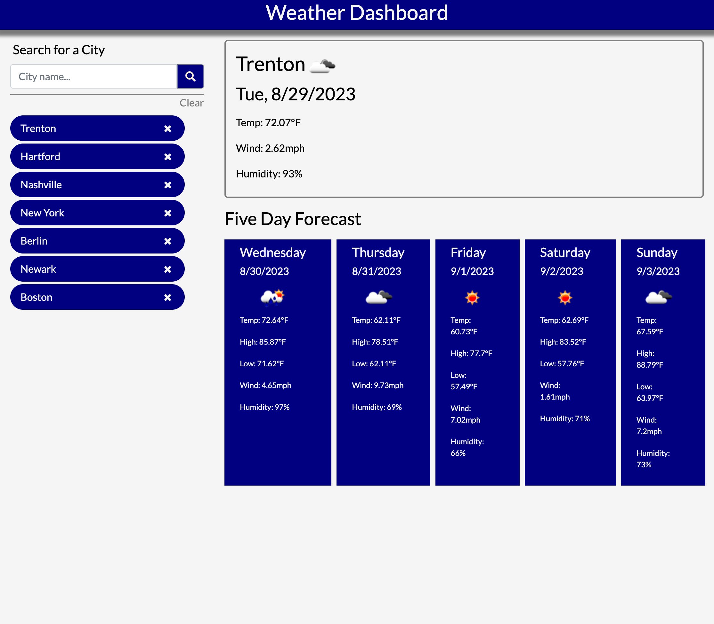

# weather-dashboard

## Description

A weather dashboard that allows the user to search for cities by name.  The application displays current temperature, wind, humidity, and weather conditions.  The application also displays a five day forecast that displays all the same information as the current day, with the addition of daily highs and lows.  The user's search history is saved, and when a previous city is selected, it displays as the current city.  Additionally, the user can clear their entire history, or delete specific cities out of their history.

## Website Link

https://caphtori.github.io/weather-dashboard/

## Screenshots

